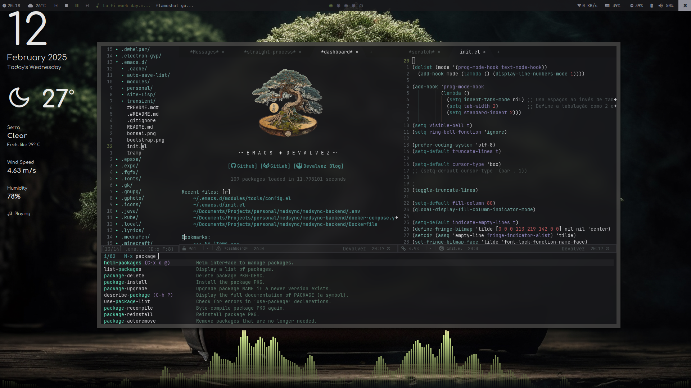
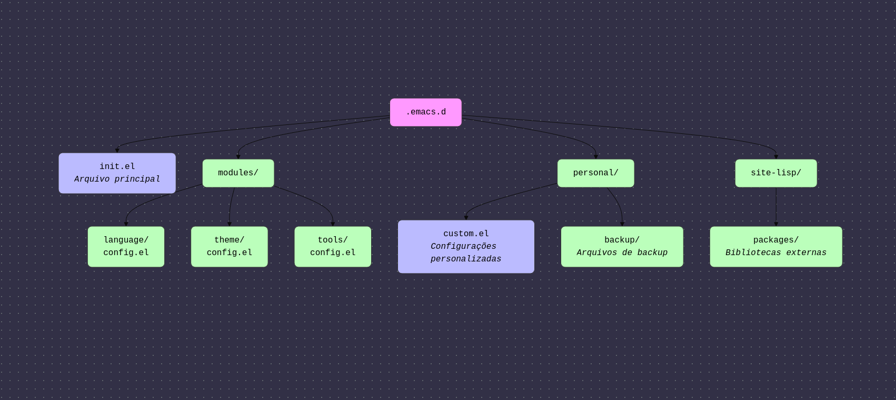

# Configuração Pessoal - Emacs 29.4 

### Visão Geral
Este repositório contém a configuração pessoal do Emacs, incluindo gerenciamento de pacotes, configurações de interface, suporte para diversas linguagens e funcionalidades adicionais para melhorar a produtividade no ambiente de desenvolvimento.



## Estrutura do Projeto



```
~/.emacs.d/
├── init.el                 # Arquivo principal de configuração do Emacs
├── modules/                # Configuração modularizada
│   ├── language/           # Configuração de linguagens
│   │   ├── config.el       # Configuração específica para linguagens de programação
│   ├── theme/              # Configuração de temas
│	├── ├── config.el
│   ├── tools/              # Ferramentas adicionais
│	│   ├── config-term.el  # Configurações para o Emacs Termimal
│	│   ├── config.el       # Configurações para o Emacs GUI
├── personal/               # Configuração pessoal (backups, customizações, etc.)
│	│   ├── auto-save-list/ # Arquivos de auto-save
│	│   ├── backup/         # Backup dos arquivos editados.
│	│   ├── undo/
│	│   ├── custom.el       # Funcionalidades personalizadas (não instalado).
├── site-lisp/              # Diretório de pacotes externos
│	│   ├── packages/       # Pacotes instalados
│	│   ├── repos/          # Pacotes clonados manualmente.
│	│   ├── straight/       # Straight gerenciador de pacotes.
└── transient/
	└── history.el
```

## Funcionalidades Principais
### Gerenciamento de Pacotes
- Utiliza `package.el` e `straight.el` para gestão de pacotes.
- Suporte ao repositório MELPA.
- Configuração para `use-package` e instalação automática.

### Interface e Usabilidade
- Ativa numeração de linhas relativa.
- Desativa barras de ferramentas e menus em interfaces gráficas.
- Configuração personalizada de cursor, preenchimento e indicação de linhas vazias.
- Suporte a temas personalizados.

### Suporte a Linguagens
- Configurações para:
  - **TypeScript & JavaScript** (`typescript-mode`, `js2-mode`, `web-mode`)
  - **React (JSX/TSX)** (`web-mode`)
  - **HTML & CSS** (`web-mode`, `emmet-mode`)
  - **Go** (`go-mode`)
  - **PHP** (`php-mode`)
  - **Markdown** (`markdown-mode`)
  - **Dotenv** (`dotenv-mode`)
  - **Docker** (`dockerfile-mode`, `docker-compose-mode`)
  - **Prisma ORM** (`prisma-mode`)
  - **SVG** (`svg-mode`)
- Integração com `lsp-mode` para suporte a LSP.
- Verificação de erros com `flycheck`.
- Autoformatação de código com `prettier-js`.

### Ferramentas Adicionais
- **Projectile**: Gerenciamento de projetos.
- **Vertico & Consult**: Melhor navegação e busca.
- **Embark**: Ações contextuais.
- **Orderless**: Melhor filtragem de completação.
- **Rainbow Delimiters & Highlight-Numbers**: Melhor visualização de código.
- **Hydra**: Menu interativo para comandos rápidos.
- **DAP Mode**: Depuração avançada.
- **Centaur Tabs**: Navegação por abas.
- **Dashboard**: Tela inicial personalizada.

### Themas
- **Kaolin Themes**:
  - kaolin-dark - a dark jade variant inspired by Sierra.vim
  - kaolin-light - light variant of the original kaolin-dark.
  - kaolin-aurora - Kaolin meets polar lights.
  - kaolin-bubblegum - Kaolin colorful theme with dark blue background.
  - kaolin-eclipse - a dark purple variant
  - kaolin-galaxy - bright theme based on one of the Sebastian Andaur arts.
  - kaolin-ocean - a dark blue variant.
  - kaolin-temple - dark background with syntax highlighting focus on blue, green and pink shades
  - kaolin-valley-dark - colorful Kaolin theme with brown background.
  - kaolin-valley-light - light variant of kaolin-valley theme.

### Customizações e Atalhos
- **Duplicar linha** (`C-d`)
- **Mover linha para cima/baixo** (`M-up` / `M-down`)
- **Screenshots dentro do Emacs**

## Instalação
1. Clone este repositório no diretório `~/.emacs.d/`:
   ```sh
   git clone https://github.com/seu-usuario/emacs-config.git ~/.emacs.d/
   ```
2. Inicie o Emacs e aguarde a instalação automática dos pacotes.
3. Personalize os arquivos dentro do diretório `personal/` conforme necessário.

